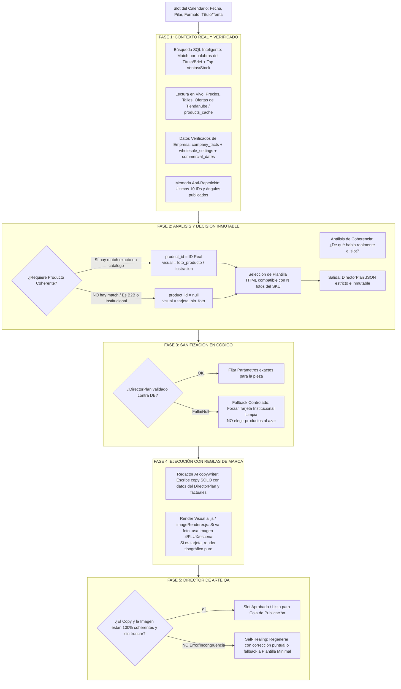

# 📋 PROMPT / ESPECIFICACIÓN DE ARQUITECTURA PARA CLAUDE (FABLE 5): REINGENIERÍA DEL "CEREBRO DE IA" (`creativeDirector`) Y FLUJO DE GENERACIÓN PERFECTA

**Proyecto:** `blacks-content-engine` (BLACKS Indumentaria)  
**Módulo Objetivo:** `src/creativeDirector.js`, `scripts/generate-daily.js`, `src/ai.js`, `src/imageRenderer.js`  
**Objetivo del Sprint:** Eliminar por completo los errores de alucinación de productos, copys incongruentes, plantillas rotas o selecciones ciegas, convirtiendo al `"Director Creativo"` en un verdadero **Cerebro Orquestador End-to-End con Control de Calidad (QA Visual/Copy) y anclaje 100% en datos reales del catálogo e información verificada**.

---

## 🛑 1. DIAGNÓSTICO DE BUGS Y BRECHAS EN LA ARQUITECTURA ACTUAL

Al auditar la interacción entre `src/creativeDirector.js` (el análisis previo) y `scripts/generate-daily.js` (la ejecución), detectamos **4 brechas críticas** por las cuales el sistema aún corre riesgo de generar piezas fallidas o incongruentes:

### Brecha 1: El "Silencio Mortal" y Fallback Ciego (`generate-daily.js` L644–L664)
* **El Problema:** Actualmente, si la llamada al `planPiece()` falla por timeout/error de JSON, o si para un pilar de tipo `'producto'` la IA devuelve `product_id: null` (porque consideró con buen criterio que ninguno de los candidatos precargados coincidía al 100% con el tema), el script **cae silenciosamente a la vieja heurística de selección ciega** (`pickMayoristaProduct` o `pickProductForSlot`).
* **Consecuencia:** La heurística elige el producto con "más ventas" o por matcheo básico de palabras clave (ej. poner un pantalón suelto cuando la pieza hablaba de uniformes corporativos). **El fallback destruye la decisión inteligente del Cerebro.**
* **La Solución:** Si el Director Creativo decide que `product_id: null` o que *no hay coincidencia digna*, la lógica en `generate-daily.js` **debe respetar esa decisión a rajatabla** y mutar la pieza a `visual: 'tarjeta_sin_foto'` o `focus: 'institucional'`. **Prohibido hacer fallback a selección aleatoria/ventas si el Cerebro ya analizó el slot.**

### Brecha 2: El "Embudo Ciego" de Candidatos (`gatherCandidates()` en `creativeDirector.js` L69–L114)
* **El Problema:** La función `gatherCandidates(slot)` busca en la base de datos solo **25 a 30 productos** (`LIMIT 30`) ordenados por `sales_30d DESC` o cantidad de fotos.
* **Consecuencia:** Si el `theme_title` o el brief del slot pide específicamente hablar de *"Calzado dieléctrico con puntera de composite para electricistas"* o *"Camisas Oxford para administración"*, pero ese SKU exacto está en el puesto #35 de ventas, **la IA nunca lo ve en su prompt**. Al no verlo, o devuelve un id erróneo que se le parezca, o devuelve `null` (activando el Bug 1).
* **La Solución:** `gatherCandidates()` no debe ser un simple `LIMIT 30` estático. Debe implementar una **búsqueda semántica o por palabras clave del brief/título (`theme_title` + `pillar_detail`) en SQL (`WHERE name ILIKE '%...%' OR category ILIKE '%...%'`)** para inyectar *primero* los 10 productos más relevantes al tema del día, y luego completar con 15-20 productos top en ventas/stock para dar variedad.

### Brecha 3: Bipolaridad entre el Director Creativo (`creativeDirector.js`) y el Copywriter (`generateCopy()` en `ai.js`)
* **El Problema:** Hoy el `creativeDirector` elige un `copy_angle`, un `focus`, un `visual` y hasta propone una `template`. Pero luego, todo eso pasa a `generateCopy()`, donde un **segundo prompt de IA** genera el copy y a veces *también* decide o cambia la plantilla (`picked_template`).
* **Consecuencia:** Hay solapamiento de decisiones. A veces el `creativeDirector` propone un tono o estructura, pero `generateCopy()` (al tener su propio system prompt genérico) termina escupiendo frases enlatadas del tipo *"Descubrí la revolución en indumentaria... Elevá tu estándar..."* o contradiciendo la nota visual.
* **La Solución:** Unificar el flujo. El `creativeDirector` entrega el **Brief Ejecutivo Inmutable (JSON estructurado)**. El generador de copy (`generateCopy`) debe actuar estrictamente como un **Redactor Subordinado** cuyo prompt le prohíba desviarse del `copy_angle`, exigiéndole verificar cada frase contra los `companyFacts` y el `product` exacto recibido.

### Brecha 4: Ausencia de Control de Calidad Posterior (QA / Self-Healing)
* **El Problema:** El Cerebro piensa **antes** (`planPiece`). El sistema genera el copy y renderiza la imagen o superpone la plantilla HTML (`imageRenderer.js`). **Y ahí termina el proceso (`slot.status = 'approved' | 'draft'`).**
* **Consecuencia:** Si la plantilla `fullbleed` truncó el título porque era muy largo, si el modelo `Imagen 3 / FLUX` generó un fondo con una aberración o si el precio en la imagen no coincide con el copy por un desfasaje de caché en milisegundos, **nadie se entera hasta que se publica**.
* **La Solución:** Crear la fase final de **"Auditoría y QA (Director de Arte)"** (`reviewAndHealPiece`). Una llamada ultra liviana y rápida que revisa la coherencia final (Copy vs Datos del Producto vs Plantilla renderizada). Si detecta un fallo, ejecuta un reintento de autocorrección (Self-Healing) antes de marcarlo listo para publicar.

---

## 🧠 2. EL DIAGRAMA DE FLUJO IDEAL Y DETALLADO DEL "CEREBRO DE IA" (END-TO-END)

Para que el sistema sea **automáticamente perfecto**, el pipeline en `scripts/generate-daily.js` debe seguir esta arquitectura de 5 Fases estables:



---

## 🛠️ 3. ESPECIFICACIONES DE CÓDIGO PARA IMPLEMENTAR EN FABLE 5

A continuación, te detallo los requerimientos exactos por archivo que debes modificar o agregar:

### A. Mejorar `gatherCandidates()` en `src/creativeDirector.js` (Búsqueda por Relevancia + Top Ventas)
Reemplazar el query estático actual por un sistema de recolección híbrido que **primero busque coincidencias exactas** con las palabras clave del título/brief del slot:

```javascript
async function gatherCandidates(slot, excludeIds = []) {
  const { eligibleSQL } = require('./productScore');
  const exc = excludeIds.length ? excludeIds : [0];
  const fields = `id, name, brand, category, price, promo_price, stock, sales_30d,
    COALESCE(jsonb_array_length(images), CASE WHEN image_url IS NULL THEN 0 ELSE 1 END) AS photos,
    LEFT(COALESCE(description, ''), 140) AS descr`;

  // 1. Extraer palabras clave limpias de theme_title + pillar_detail (ej: "calzado", "botin", "chomba", "seguridad")
  const rawQuery = `${slot.theme_title || ''} ${slot.pillar_detail || ''}`.toLowerCase();
  const keywords = rawQuery.split(/[^a-záéíóúñ0-9]+/i).filter(w => w.length > 3 && !['para', 'como', 'sobre', 'este', 'esta', 'todo', 'toda'].includes(w));
  
  let keywordRows = [];
  if (keywords.length > 0) {
    // Construimos condiciones LIKE para priorizar productos que rimen con el tema
    const likeConditions = keywords.map((_, i) => `(name ILIKE $${i + 2} OR category ILIKE $${i + 2} OR COALESCE(description,'') ILIKE $${i + 2})`).join(' OR ');
    const params = [exc, ...keywords.map(k => `%${k}%`)];
    const { rows } = await pool.query(
      `SELECT ${fields} FROM products_cache
       WHERE published IS NOT FALSE AND image_url IS NOT NULL
         AND NOT (id = ANY($1)) AND (${likeConditions})
       ORDER BY sales_30d DESC NULLS LAST LIMIT 12`,
      params
    );
    keywordRows = rows;
  }

  const foundIds = keywordRows.map(r => r.id);
  const combinedExclude = [...exc, ...foundIds];

  // 2. Completar con los Top en Ventas/Stock según pilar (hasta llegar a 30 candidatos)
  const remainingLimit = Math.max(5, 30 - keywordRows.length);
  let baseRows = [];

  if (slot.pillar === 'mayorista') {
    const { rows } = await pool.query(
      `SELECT ${fields} FROM products_cache
       WHERE published IS NOT FALSE AND image_url IS NOT NULL
         AND (stock IS NULL OR price IS NULL OR price <= 0)
         AND NOT (id = ANY($1))
       ORDER BY COALESCE(jsonb_array_length(images), 1) DESC, sales_30d DESC NULLS LAST
       LIMIT $2`,
      [combinedExclude, remainingLimit]
    );
    baseRows = rows;
  } else if (['producto', 'promo'].includes(slot.pillar)) {
    const { rows } = await pool.query(
      `SELECT ${fields} FROM products_cache
       WHERE ${eligibleSQL()} AND NOT (id = ANY($1))
       ORDER BY sales_30d DESC NULLS LAST, stock DESC
       LIMIT $2`,
      [combinedExclude, remainingLimit]
    );
    baseRows = rows;
  } else {
    const { rows } = await pool.query(
      `SELECT ${fields} FROM products_cache
       WHERE published IS NOT FALSE AND image_url IS NOT NULL AND stock > 0 AND price > 0
         AND NOT (id = ANY($1))
       ORDER BY sales_30d DESC NULLS LAST
       LIMIT $2`,
      [combinedExclude, remainingLimit]
    );
    baseRows = rows;
  }

  // Devolvemos PRIMERO los que coinciden con el brief/título, y LUEGO los generales top de catálogo
  return [...keywordRows, ...baseRows];
}
```

---

### B. Blindar la Decisión y Eliminar el Fallback Ciego en `scripts/generate-daily.js`
En la sección donde se procesa `directorPlan` en `generate-daily.js` (aprox. línea 654 en adelante), **se debe prohibir la llamada a las heurísticas antiguas si el Cerebro ya ejecutó y dictaminó `product_id: null`**:

```javascript
  // Producto protagonista:
  let product = null;
  if (!noProductBrief) {
    if (slot.forced_product_id) {
      product = await pickForcedProduct(slot.forced_product_id);
    } else if (directorPlan && directorPlan.product) {
      product = await pickForcedProduct(directorPlan.product.id); // Refresca precio/stock en vivo
    } else if (directorPlan && !directorPlan.product) {
      // REGLA DE ORO DE ARQUITECTURA: Si el Director Creativo analizó el slot y decidió que
      // ningún candidato coincide con el mensaje (product_id === null), RESPETAMOS SU DECISIÓN.
      // Queda prohibido disparar pickMayoristaProduct() o pickProductForSlot() al azar.
      console.log(`[generate-daily] Director decidió NO usar producto para slot #${slot.id}. Mantenemos tarjeta institucional o visual sin producto.`);
      product = null;
    } else if (!directorPlan && slot.pillar === 'producto') {
      // SOLO si el Director falló completamente por red/API, caemos a la vieja heurística
      product = isMayorista
        ? await pickMayoristaProduct(effectiveSlot, recentIds)
        : await pickProductForSlot(effectiveSlot);
    }
  }
```

---

### C. Prompt de `planPiece` (`creativeDirector.js`) y `generateCopy` (`ai.js`): Reglas Estrictas Anti-Alucinación y Anti-Marketing Genérico

Debes asegurar que tanto en `buildDirectorPrompt()` como en el system prompt de `generateCopy()` se inyecten estas directrices obligatorias de estilo e inteligencia:

1. **PROHIBIDO INVENTAR DATOS NI ATRIBUTOS:** *"Si el candidato seleccionado se llama 'Botín Prusiano Puntera de Acero', el copy no puede inventar que tiene 'suela de Kevlar ultraliviana' ni que está 'en 6 cuotas sin interés' si los datos factuales (`wholesale_settings`, `companyFacts` y el objeto `product`) no lo afirman explícitamente. Cada precio, porcentaje de descuento o cuota mencionada debe tomarse literal del string de entrada."*
2. **TONO ARGENTINO DIRECTO Y PROFESIONAL (CERO IA-SPEAK):** *"Prohibido el uso de verbos y adjetivos enlatados de IA publicitaria del tipo: 'Descubrí', 'Elevá tu estándar', 'Revolucioná tu jornada', 'Sumérgete en', 'El aliado perfecto'. Escribir como un dueño o vendedor técnico experto en ropa de trabajo y calzado industrial en Argentina: directo, robusto, hablando de durabilidad, stock real, precios claros, envíos y condiciones mayoristas concretas."*
3. **COHERENCIA DE PLANTILLA SEGÚN FOTOS:** *"Si `photos === 1` en el producto elegido, queda estrictamente prohibido proponer plantillas como `grid` o carruseles multiescena que requieran múltiples ángulos del producto. Para 1 foto: usar plantillas `fullbleed`, `minimal` o `promo`."*

---

### D. Crear el Módulo de Control de Calidad post-render (`reviewAndHealPiece` en `src/creativeDirector.js` o nuevo `src/qaDirector.js`)

Implementar la **Fase 5 (QA)** justo antes de guardar la pieza o marcarla como `approved` en `generate-daily.js`:

```javascript
/**
 * QA POST-RENDER (Auditoría final por el Director de Arte IA).
 * Verifica que el copy no tenga alucinaciones obvias, que los precios coincidan
 * y que la decisión visual se haya respetado.
 */
async function reviewAndHealPiece({ slot, copy, product, directorPlan, renderedVisualUrl }) {
  // Si la pieza no tiene producto ni datos sensibles, o es un draft rápido, pasa el QA directo.
  if (!copy || !copy.caption) return { status: 'passed', copy };

  const qaPrompt = `Sos el DIRECTOR DE ARTE y QA DE CALIDAD de BLACKS Indumentaria.
Audita esta pieza recién generada antes de enviarla al cliente/publicación:

COPY GENERADO:
"\${copy.caption}"

DATOS REALES DEL PRODUCTO / CONTEXTO:
\${product ? \`- Producto: \${product.name} | Precio: $\${product.price} | Promo: $\${product.promo_price || 'N/A'}\` : '- Sin producto (pieza institucional/tema)'}
- Director Plan (Intención original): Focus=\${directorPlan?.focus}, Visual=\${directorPlan?.visual}

REVISÁ ESTOS 3 PUNTOS:
1. ¿El copy inventa características técnicas, precios erróneos o promociones que no están en los datos reales?
2. ¿El copy usa frases prohibidas de IA ("Descubrí", "Elevá tu estándar", "Revolución")?
3. ¿Hay coherencia absoluta entre el tipo de pieza y el texto?

Si todo está perfecto y natural, respondé: {"passed": true, "reason": "OK"}
Si hay errores, corregí el texto (manteniendo el formato, hashtags y saltos de línea) y respondé:
{"passed": false, "reason": "Explicación del error", "corrected_caption": "Texto corregido prolijo y sin alucinaciones"}`;

  try {
    const result = await generateJson({
      system: 'Auditor de calidad y copy technical editor. Solo JSON.',
      prompt: qaPrompt,
      maxTokens: 500,
      temperature: 0.1
    });

    if (result && result.passed === false && result.corrected_caption) {
      console.warn(`[QA Director] Corrigiendo alucinación o tono de IA en slot #\${slot.id}: \${result.reason}`);
      copy.caption = result.corrected_caption;
      return { status: 'healed', reason: result.reason, copy };
    }
  } catch (err) {
    console.warn(`[QA Director] Timeout en auditoría, pasando pieza: \${err.message}`);
  }

  return { status: 'passed', copy };
}
```

---

## 🏁 4. RESUMEN DE CHECKLIST ACCIONABLE PARA FABLE 5 EN SU PRÓXIMO TURNO

Al iniciar la sesión, ejecuta los siguientes pasos en orden para no romper la estabilidad del servidor local (`server.js`) ni de la cola de publicación (`publishService.js`):

1. **Reemplazar `gatherCandidates()` en `src/creativeDirector.js`** agregando la búsqueda por palabras clave (`ILIKE`) contra `theme_title` y `pillar_detail` antes del orden por ventas de `products_cache`.
2. **Bloquear el Fallback Ciego en `scripts/generate-daily.js`**: Si `directorPlan && !directorPlan.product`, obligar a que `product = null` y prohibir que se ejecute `pickMayoristaProduct()` o `pickProductForSlot()`.
3. **Endurecer el system prompt de `generateCopy()` en `src/ai.js`** insertando la lista explícita de *Frases Prohibidas de IA-Speak* y la regla de no alucinar atributos no descriptos en `product.description` ni en `companyFacts`.
4. **Conectar la Auditoría QA (`reviewAndHealPiece`) al final de `generateForSlot()` en `scripts/generate-daily.js`** para que verifique e higienice automáticamente el `caption` antes de guardar en base de datos.
5. **Correr pruebas de verificación en terminal (`--check` + prueba de planPiece):**
   ```bash
   node --check src/creativeDirector.js
   node --check scripts/generate-daily.js
   node --check src/ai.js
   ```

Con estos 5 pasos implementados, el **Cerebro de IA** quedará blindado: cada pieza tendrá sentido, el producto será 100% real y afín al brief, la plantilla coincidirá con el número de fotos reales y los copys tendrán la firmeza de una marca industrial de primer nivel.
